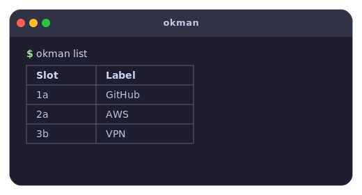

# okman

<div align="center">
  
</div>

<br>

Rust CLI to manage OnlyKey slot passwords via USB HID.

## Why okman?

The official [OnlyKey App](https://github.com/trustcrypto/OnlyKey-App) is an Electron desktop app — great for initial setup, but heavyweight for day-to-day slot management. The [python-onlykey](https://github.com/trustcrypto/python-onlykey) CLI works but requires a Python runtime and pip dependencies.

okman is a single static binary with no runtime dependencies. It does one thing: manage OnlyKey slots from the terminal.

- **No runtime** — no Python, no Node.js, no Electron
- **Single binary** — `cargo install okman` or drop the binary in your PATH
- **Fast** — connects and executes in milliseconds
- **Scriptable** — easy to integrate into dotfiles, provisioning scripts, or CI

| Tool | Size | Runtime required |
| ---- | ---- | ---------------- |
| **okman** | **~1 MB** | None |
| python-onlykey | ~50 KB + ~100 MB Python | Python 3 + pip |
| OnlyKey App | ~200 MB | Electron (bundled) |

## Install

```bash
cargo install okman
```

Or build from source:

```bash
git clone https://github.com/flamenkito/okman.git
cd okman
cargo build --release
# binary at target/release/okman
```

## Prerequisites

- OnlyKey device connected over USB
- Device must be unlocked (enter the PIN on the physical device)

### Linux permissions

You will likely need udev rules so your user can access the HID device without root:

```text
# /etc/udev/rules.d/49-onlykey.rules
SUBSYSTEM=="hidraw", ATTRS{idVendor}=="16c0", ATTRS{idProduct}=="0486", MODE="0660", GROUP="plugdev"
SUBSYSTEM=="hidraw", ATTRS{idVendor}=="1d50", ATTRS{idProduct}=="60fc", MODE="0660", GROUP="plugdev"
```

## Usage

List configured slots:

```bash
okman list
```

Set slot fields (all flags are optional, but at least one is required):

```bash
okman set 1a --label "GitHub" --username "alice@example.com"
okman set 1a --password
okman set 1a -l "GitHub" -u "alice" -p --enter-after-password
okman set 2b -l "Bank"
```

Wipe a slot (asks for confirmation):

```bash
okman wipe 1a
```

<details>
<summary>Slot mapping</summary>

| Button | Short press | Long press |
| ------ | ----------- | ---------- |
| 1 | 1a | 1b |
| 2 | 2a | 2b |
| 3 | 3a | 3b |
| 4 | 4a | 4b |
| 5 | 5a | 5b |
| 6 | 6a | 6b |

Short press = slots 1–6, long press = slots 7–12.

</details>

## Security

- PIN entry happens on the physical device and is never sent over USB.
- The CLI refuses to operate if the device is locked or uninitialized.
- Stored passwords cannot be read back over USB — they can only be typed out by pressing the physical button.

## License

[MIT](LICENSE)
